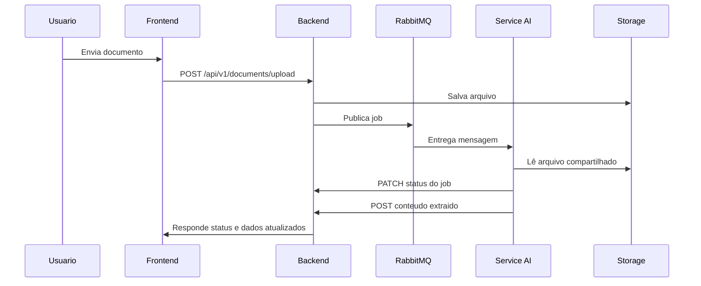

# DocFlow AI

Plataforma para upload, extração e acompanhamento de documentos com processamento assíncrono. O fluxo principal e:

1. O usuário faz login ou cadastro.
2. Envia um PDF ou imagem.
3. O backend salva o arquivo, cria um `job` e publica a tarefa no RabbitMQ.
4. O `service-ai` consome a fila, extrai o texto e grava o conteúdo no backend.
5. A interface mostra o progresso e o historico em tempo real.

## Visao geral

O projeto esta dividido em tres partes:

- `backend`: API Java Spring Boot responsavel por autenticação, documentos, jobs, persistencia e seguranca.
- `frontend`: SPA Angular responsavel pela experiencia do usuario.
- `service-ai`: worker Python que consome a fila RabbitMQ e executa a extracao de texto.

Infraestrutura local:

- PostgreSQL para persistencia.
- RabbitMQ para mensageria.
- Volume compartilhado para arquivos enviados em `storage/uploads`.

## Principais funcionalidades

- Cadastro e login com JWT.
- Upload de documentos PDF e imagens.
- Extracao de texto automatica com pipeline assíncrono.
- Leitura de PDF nativo e OCR para imagens.
- Acompanhamento de status, progresso e erros por documento e por job.
- Exclusao de documentos e jobs.

## Stack

- Backend: Java 21, Spring Boot 4, Spring Security, JPA, RabbitMQ.
- Frontend: Angular 22, TypeScript, RxJS, Tailwind CSS.
- Worker: Python 3, FastAPI dependencies para suporte de runtime, Pika, PyMuPDF, OpenCV, Tesseract, Pillow.
- Banco: PostgreSQL 16.
- Fila: RabbitMQ 3.

## Estrutura do projeto

```text
.
|-- backend/        API principal
|-- frontend/       Aplicacao web
|-- service-ai/     Worker de extracao
|-- storage/        Arquivos enviados
|-- docker-compose.yml
`-- README.md
```

## Arquitetura do fluxo



## Endpoints principais

### Autenticacao

- `POST /api/v1/auth/register`
- `POST /api/v1/auth/login`

### Documentos

- `GET /api/v1/documents`
- `POST /api/v1/documents/upload`
- `GET /api/v1/documents/{id}`
- `GET /api/v1/documents/{id}/status`
- `DELETE /api/v1/documents/{id}`
- `POST /api/v1/documents/{documentId}/content`

### Jobs

- `GET /api/v1/jobs`
- `GET /api/v1/jobs/{jobId}`
- `DELETE /api/v1/jobs/{jobId}`
- `PATCH /api/v1/jobs/{jobId}/status`

## Requisitos

- Java 21
- Maven 3.9+ ou o wrapper do projeto
- Node.js 22+ e npm 11+
- Python 3.11+
- Docker e Docker Compose
- Tesseract OCR instalado no sistema para leitura de imagens no worker

## Rodando com Docker

A forma mais simples de subir tudo e usar o `docker-compose.yml`.

```bash
docker compose up --build
```

Servicos expostos:

- Frontend: `http://localhost:4200` ou a porta configurada no build do frontend.
- Backend: `http://localhost:8080`
- Worker AI: `http://localhost:8000`
- RabbitMQ Management: `http://localhost:15672`
- PostgreSQL: `localhost:5432`

Credenciais padrao do compose:

- Banco: `docflow / docflow`
- RabbitMQ: `guest / guest`

Os arquivos enviados ficam em `storage/uploads`.

## Rodando localmente

Se preferir executar cada parte separadamente:

### 1. Inicie a infraestrutura

Suba PostgreSQL e RabbitMQ com o compose:

```bash
docker compose up postgres rabbitmq
```

### 2. Backend

Em `backend/`, execute:

```bash
./mvnw spring-boot:run
```

Configuracao padrao em `backend/src/main/resources/application.yaml`:

- banco em `jdbc:postgresql://localhost:5432/docflow`
- RabbitMQ em `localhost:5672`
- upload em `storage/uploads`

### 3. Worker AI

Em `service-ai/`, instale as dependencias e execute:

```bash
pip install -r requirements.txt
python main.py
```

Variaveis uteis:

- `BACKEND_BASE_URL`
- `RABBITMQ_HOST`
- `RABBITMQ_PORT`
- `RABBITMQ_USER`
- `RABBITMQ_PASS`
- `RABBITMQ_QUEUE`
- `STORAGE_UPLOADS_PATH`

### 4. Frontend

Em `frontend/`, instale e rode:

```bash
npm install
npm start
```

O frontend usa `frontend/src/environments/environment.ts` com:

```ts
apiUrl: 'http://127.0.0.1:8080/api/v1'
```

O `proxy.conf.json` tambem aponta `/api` para `http://127.0.0.1:8080`.

## Funcionalidades da interface

- `Login` e `Register` para acesso ao sistema.
- `Upload` para envio de arquivos com barra de progresso.
- `Meus Arquivos` para listar documentos e jobs, com atualizacao a cada 5 segundos.
- `Detalhes do documento` para acompanhar status e conteudo extraido.

## Processamento de documentos

O worker identifica o tipo do arquivo pela extensao:

- `.pdf`: extracao direta de texto com PyMuPDF.
- `.jpg`, `.jpeg`, `.png`: OCR com OpenCV + Tesseract.

Se o PDF nao tiver texto extraivel, o worker retorna erro no job.

## Observacoes de configuracao

- O backend usa JWT para proteger as rotas de documentos e jobs.
- O token fica salvo em `sessionStorage` no frontend.
- O backend grava arquivos em `storage/uploads` usando o `documentId` como parte do nome.
- O worker busca o arquivo compartilhado por `documentId` na mesma pasta de upload.

## Problemas comuns

- Se o upload falhar, verifique se o backend esta rodando e se o usuario esta autenticado.
- Se o OCR nao funcionar, confirme se o Tesseract esta instalado e disponivel no PATH.
- Se os jobs ficarem presos em `PENDING`, confirme se o RabbitMQ esta ativo e se o worker esta consumindo a fila.
- Se o conteudo extraido nao aparecer, confira os logs do backend e do worker e a pasta `storage/uploads`.

## Licenca

Sem licenca declarada no projeto.
